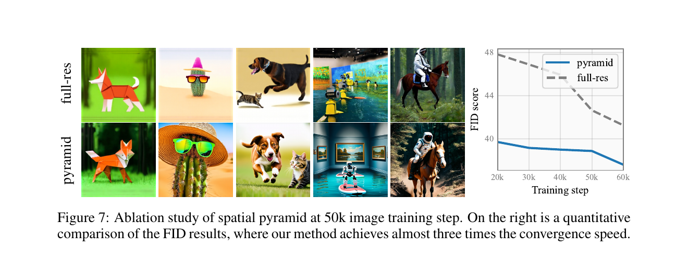

## Outline {.compact-title data-section="Roadmap"}

  
<b>01</b><strong>Motivation + preliminaries</strong>Why full-resolution video is expensive, and what flow matching makes possible. <em>§1–2</em>

  
<b>02</b><strong>Spatial pyramidal flow</strong>Split one trajectory across resolutions, then train it as one model. <em>§3</em>

  
<b>03</b><strong>Video generation</strong>Compress distant history and preserve causality across frame units. <em>§4</em>

  
<b>04</b><strong>Experiments + implementation + demo</strong>Controlled evidence for the efficiency claim, the code behind it, then a live demonstration. <em>§5–6</em>

## Motivation {.compact-title data-section="1 · Introduction"}

  
<strong>Full-resolution diffusion</strong>pays for fine spatial grids even when the latent is mostly noise.

  
<strong>Pyramidal flow</strong>increases resolution as semantic structure emerges.

::: {.source}
Source: Jin et al., “Pyramidal Flow Matching for Efficient Video Generative Modeling,” Fig. 1.
:::

## Prior Approaches {.compact-title data-section="1 · Introduction"}

  
<small>ONE FULL-RESOLUTION PATH</small><strong>Every model call sees the largest latent grid</strong>
768p<b>×</b>240 frames<b>×</b>many solver steps
<ul><li>High attention and memory cost from the first noisy state</li><li>Limits batch size, duration, or output resolution</li></ul>

  
<small>SEPARATE CASCADE · CLASSICAL PYRAMID LINEAGE</small><strong>Generate low resolution, then refine with other models</strong>
base model<b>→</b>spatial SR<b>→</b>temporal SR
<ul><li>Multiple objectives, checkpoints, and training pipelines</li><li>Weak parameter sharing across stage boundaries</li></ul>

  

::: {.thesis}
Pyramidal Flow seeks one end-to-end path that uses small grids early and one shared model throughout.
:::

## Latent Video Generation {.compact-title data-section="2 · Preliminaries"}

  
<small>TRAINING · HOW THE MODEL SEES VIDEOS</small>
real video frames<b>→</b>VAE encoder<b>→</b>compact latents<b>→</b>DiT learns on these

  
<small>GENERATION · NO INPUT FRAMES — STARTS FROM NOISE</small>
latent noise<b>→</b>generation — this talk<b>→</b>clean latent<b>→</b>VAE decoder<b>→</b>RGB video

<b>Compression:</b> 8× height · 8× width · 8× time<b>Causal:</b> the first frame is encoded alone—an image is a valid one-frame video<b>Frozen:</b> trained once beforehand, not part of this paper's training

::: {.takeaway}
The VAE is a separate model—trained once, then frozen. Everything in this talk happens in its latent space.
:::

## Flow Matching vs. Diffusion {.compact-title data-section="2 · Preliminaries"}

  
<strong>Diffusion</strong>defines a stochastic corruption process first, then learns to reverse it—curved probability paths that need many steps.

  
<strong>Flow matching</strong>chooses the path first—a deterministic ODE along straight interpolation lines from noise to data.

<b>Like diffusion:</b> iterative generation from noise<b>Unlike diffusion:</b> the path is designed, not derived<b>Straight paths:</b> tolerate few large Euler steps—on curved paths they overshoot

## Flow Matching {.compact-title data-section="2 · Preliminaries"}

  
<small>TRAINING · ONE RANDOM TIME</small>
noise <b>x₀</b><b>+</b>data <b>x₁</b><b>→</b>intermediate <b>xₜ</b><b>→</b>DiT predicts <b>vθ</b>

<em>Math</em>
xₜ = (1−t)x₀ + tx₁ target = x₁ − x₀

<pre><code>t = torch.rand(batch, 1, 1, 1, 1)
x_t = (1 - t) * x_0 + t * x_1
target = x_1 - x_0
loss = (dit(x_t, t) - target).square().mean()</code></pre>

  
<small>INFERENCE · SOLVE THE LEARNED ODE</small>
Gaussian noise<b>→</b>velocity<b>→</b>Euler update<b>↻</b>video latent

No denoising chain is simulated during training. At inference, repeated velocity evaluations transport noise to data.

::: {.takeaway}
Nothing fixes the path's endpoints. A segment can start at one resolution and end at another—this is the freedom the pyramid exploits.
:::

::: {.source}
Flow matching formulation: Lipman et al., “Flow Matching for Generative Modeling,” arXiv:2210.02747.
:::

## The Spatial Pyramid {.compact-title data-section="3 · Pyramidal flow matching"}

  
<small>STAGE 1</small><strong>¼ resolution</strong>composition and coarse motion

  
upsample <em>+ re-noise</em>

  
<small>STAGE 2</small><strong>½ resolution</strong>shapes and scene layout

  
upsample <em>+ re-noise</em>

  
<small>STAGE 3</small><strong>full resolution</strong>texture and fine detail

  
<strong>Start of stage k</strong>sk · Up(Downk+1(x₁)) + (1−sk) · n — the upsampled coarser latent, at higher noise.

  
<strong>End of stage k</strong>ek · Downk(x₁) + (1−ek) · n — this stage's own latent, at lower noise. Sharing the noise n keeps the path straight.

::: {.takeaway}
Each stage is a straight flow between two noisy versions of the *same* video. The arrows are the hard part: crossing a boundary must preserve the signal *and* the noise statistics.
:::

## Attention Cost {.compact-title data-section="3 · Pyramidal flow matching"}

  
<strong>Tokens per frame</strong>Quarter resolution means a quarter of the width and a quarter of the height—only 1/16 of the tokens.

  
<strong>Attention cost</strong>Attention scales with the square of the token count—so an early step costs roughly 1/256 of a full-resolution step.

::: {.takeaway}
Most solver steps run on the small grids; the full grid is only touched at the end. One caveat: attention also spans history tokens—compressing those is the job of §4.
:::

## Stages in Practice {.compact-title data-section="3 · Pyramidal flow matching"}

  
<video src="assets/stage-0.mp4" poster="assets/stage-0.jpg" autoplay muted loop playsinline></video><strong>160 × 96</strong>global color and layout

  
<video src="assets/stage-1.mp4" poster="assets/stage-1.jpg" autoplay muted loop playsinline></video><strong>320 × 192</strong>objects and motion stabilize

  
<video src="assets/stage-2.mp4" poster="assets/stage-2.jpg" autoplay muted loop playsinline></video><strong>640 × 384</strong>high-frequency detail appears

::: {.takeaway}
The coarse stage already chooses the scene; later stages spend compute on increasingly fine evidence.
:::

## Stage Transitions {.compact-title data-section="3 · Pyramidal flow matching"}

  
<strong>1 · finish a stage</strong>Integrate the learned flow on the current grid.

  <b>→</b>
  
<strong>2 · upsample</strong>Copying values creates blockwise correlation.

  <b>→</b>
  
<strong>3 · re-noise</strong>Correct the covariance before continuing.

<pre><code>latents = F.interpolate(
    latents, size=(height, width), mode="nearest"
)
noise = self.sample_block_noise(
    bs, ch, temp, height, width
)
latents = alpha * latents + beta * noise</code></pre>

<small>TRANSITION RULE</small>
<em>covariance correction</em>
xnext = α Up(xprev) + β nblock

<em>boundary constraint</em>
ek+1 = 2sk / (1+sk) — noise level is continuous across the jump

<b>Goal:</b> match the mean <i>and</i> covariance of the start point the next stage saw in training. <i>n</i>block has correlation −1/3 between the four pixels of each 2 × 2 block, exactly cancelling the +1 correlation that nearest-neighbour upsampling duplicates.

::: {.source}
Jin et al., Sec. 3.2; repository implementation: <code>sample_block_noise()</code> and the stage-transition logic.
:::

## Pyramidal Training {.compact-title data-section="3 · Pyramidal flow matching"}

clean video<b>→</b>VAE latent pyramid<b>→</b>sample stage + time<b>→</b>coupled endpoints<b>→</b>shared DiT + MSE

<pre><code>noisy_latents = (
    ratios * start_point
    + (1 - ratios) * end_point
)
target = start_point - end_point
prediction = dit(noisy_latents, timesteps)
loss = (prediction - target).square().mean()</code></pre>

<small>MATH BEHIND THE CODE</small>
<em>interpolate</em>
xᵣ = r xstart + (1−r)xend
<small class="ratio-direction">repository convention: r decreases 1 → 0</small>

<em>velocity target</em>
uᵣ = xstart − xend

<em>one time axis</em>
[0,1] splits into windows [sk, ek] — t alone tells the DiT which stage it is in

Sharing noise across resolutions couples adjacent stage endpoints—training sees the same boundary distributions the sampler produces.

::: {.source}
Jin et al., Sec. 3.1; repository implementation: <code>add_pyramid_noise_with_temporal_pyramid()</code>.
:::

## The Temporal Pyramid {.compact-title data-section="4 · Video generation"}

  
<small>OLDER UNITS · t−3, t−2</small><i></i><strong>¼ spatial grid</strong>1/16 of full spatial tokens per frame

  <b>→</b>
  
<small>RECENT UNIT · t−1</small><i></i><strong>½ spatial grid</strong>1/4 of full spatial tokens per frame

  <b>→</b>
  
<small>CURRENT UNIT · t</small><i></i><strong>full spatial grid</strong>denoised now

compressed past conditions<b>→ blockwise causal attention →</b><strong>current unit</strong><em>future units are unavailable</em>

<b>Older context:</b> identity and scene state<b>Recent context:</b> local motion continuity<b>Current unit:</b> full-detail prediction

<b>Unit:</b> here one latent frame ≈ 8 video frames<b>No train/test gap:</b> training also conditions on the compressed history<b>Drift control:</b> history is lightly noised (strength ≤ 1/3) during training

## Architecture {.compact-title data-section="4 · Video generation"}

<small>PROMPT · FROZEN, PRETRAINED</small><strong>Text encoder</strong>token embeddings + pooled embedding

<small>PIXELS · SEPARATE MODEL, FROZEN</small><strong>Causal video VAE</strong>encode frames → latent pyramid

<small>PAST UNITS · NO PARAMETERS</small><strong>Temporal pyramid</strong>coarse old context + detailed recent context

conditions<b>→</b>

<small>ONE SHARED NETWORK · TRAINED IN THIS PAPER</small><strong>Diffusion Transformer</strong>inputs: current noisy latent, past conditions, timestep, text<b>output: velocity field</b>

← xt, tvθ →

<small>CONTROL LOOP · PURE CODE, NO PARAMETERS</small><strong>Pyramid Euler scheduler</strong>stage timesteps → Euler update → upsample + block noise

<small>FINAL LATENT · SAME FROZEN VAE</small><strong>VAE decoder</strong>latent video → RGB frames

Only the DiT is trained. The VAE and text encoder are frozen separate models; the scheduler is plain code. Savings come from feeding the DiT fewer high-resolution tokens.

## The Inference Loop {.compact-title data-section="5 · Project implementation"}

<small><code>generate_one_unit()</code> · CORE LOOP</small><pre><code>for stage in range(len(stages)):
    scheduler.set_timesteps(steps[stage], stage)

    if stage > 0:
        latents = F.interpolate(latents, mode="nearest")
        noise = sample_block_noise(latents.shape)
        latents = alpha * latents + beta * noise

    for t in scheduler.timesteps:
        model_input = past_conditions[stage] + [latents]
        velocity = dit(model_input, t, text_embeddings)
        latents = scheduler.step(velocity, t, latents).prev_sample</code></pre>

<b>1</b><strong>Select the stage schedule</strong>Each resolution receives its own timestep range.

<b>2</b><strong>Repair the stage boundary</strong>Nearest upsample, then covariance-matching block noise.

<b>3</b><strong>Attach temporal context</strong>Past frame units are prepended at the stage's resolutions.

<b>4</b><strong>Integrate the velocity</strong>The Euler scheduler advances the current latent.

Pyramid-Flow/pyramid_dit/pyramid_dit_for_video_gen_pipeline.py · lines 927–1031 · own addition: export of each stage's intermediate output — the stage videos shown earlier

## Convergence Ablation {.compact-title data-section="6 · Experiments"}

<small>CONTROLLED BASELINE</small><strong>≈ 3×</strong><b>FID convergence speed</b><ul><li>same training data</li><li>same tokens per batch</li><li>same hyperparameters</li><li>same model architecture</li></ul>

::: {.source}
Jin et al., Fig. 7 and Sec. 4.4.
:::

## VBench Results {.compact-title data-section="6 · Experiments"}

<b>open-source</b> data only<b>20.7k</b> A100 GPU hours<b>768p</b> output<b>24 fps</b><b>5–10 s</b> clips

<table class="quality-table">
<thead><tr><th>System</th><th>Total</th><th>Quality</th><th>Semantic</th><th>Motion</th></tr></thead>
<tbody>
<tr><td>Gen-3 Alpha <small>commercial</small></td><td>82.32</td><td>84.11</td><td>75.17</td><td>99.23</td></tr>
<tr><td>VideoCrafter2</td><td>80.44</td><td>82.20</td><td>73.42</td><td>97.73</td></tr>
<tr><td>T2V-Turbo</td><td>81.01</td><td>82.57</td><td>74.76</td><td>97.34</td></tr>
<tr class="ours"><td>Pyramid Flow</td><td>81.72</td><td>84.74</td><td>69.62</td><td>99.12</td></tr>
</tbody>
</table>

<small>STRENGTH</small><strong>84.74</strong>visual-quality score

<small>LIMITATION</small><strong>69.62</strong>semantic score

::: {.source}
Jin et al., VBench comparison in Table 1. Scale figures describe the main public-data model. Systems differ in data, scale, infrastructure, and generation setup.
:::

## Conclusion {.compact-title data-section="7 · Conclusion"}

  
<h3>What the pyramid gets right</h3><ul><li>Compute follows information content.</li><li>One DiT shares knowledge across scales.</li><li>Spatial and temporal savings compound.</li><li>Text-to-video and image-to-video fit naturally.</li></ul>

  
<h3>What remains constrained</h3><ul><li>Autoregressive only; no keyframe interpolation.</li><li>Compressed history can cause long-term inconsistency.</li><li>Stage transitions require matched noise statistics.</li><li>Quality still depends on data and the base DiT.</li></ul>

::: {.source}
[Paper](https://arxiv.org/abs/2410.05954) · [Code](https://github.com/jy0205/Pyramid-Flow) · [Project page and videos](https://pyramid-flow.github.io/)
:::

## One path · three resolutions · one shared model {.final-slide data-section="Closing"}

<small>PYRAMIDAL FLOW MATCHING</small><strong>Use coarse grids while uncertainty is high. Increase resolution as structure becomes reliable.</strong>Live demo → questions

## Live Demo {.demo-slide data-section="8 · Demo"}

<small>PYRAMID FLOW</small><strong>DEMO</strong>Local Gradio interface

