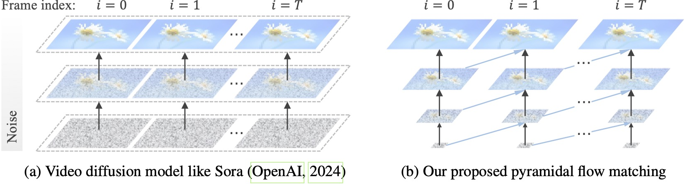

## The paper builds one idea across four steps {.compact-title data-section="Paper structure"}

  
<b>01</b><strong>Motivation + preliminaries</strong>Why full-resolution video is expensive, and what flow matching makes possible.

  
<b>02</b><strong>Spatial pyramidal flow</strong>Split one trajectory across resolutions, then train it as one model.

  
<b>03</b><strong>Video generation</strong>Compress distant history and preserve causality across frame units.

  
<b>04</b><strong>Project + experiments</strong>Connect the repository implementation to controlled evidence and a live demonstration.

::: {.notes}
- The talk follows the paper: problem, flow matching, spatial pyramid, temporal pyramid, then code and results.
- Main question: does a mostly noisy latent need the final spatial resolution?
- Paper's answer: increase fidelity only as usable information appears.
:::

## Earlier designs choose between full-resolution cost and separate cascades {.compact-title data-section="1 · Introduction"}

  
<small>ONE FULL-RESOLUTION PATH</small><strong>Every model call sees the largest latent grid</strong>
768p<b>×</b>240 frames<b>×</b>many solver steps
<ul><li>High attention and memory cost from the first noisy state</li><li>Limits batch size, duration, or output resolution</li></ul>

  
<small>SEPARATE CASCADE</small><strong>Generate low resolution, then refine with other models</strong>
base model<b>→</b>spatial SR<b>→</b>temporal SR
<ul><li>Multiple objectives, checkpoints, and training pipelines</li><li>Weak parameter sharing across stage boundaries</li></ul>

::: {.thesis}
Pyramidal Flow seeks one end-to-end path that uses small grids early and one shared model throughout.
:::

::: {.notes}
- A ten-second clip at 24 fps is already 240 frames.
- The VAE compresses pixels, but the DiT still revisits a large spatiotemporal token grid many times.
- Full-resolution training pays that cost even when the state is mostly noise, limiting batch size, duration, or output resolution.
- Cascades reduce the grid size, but introduce separate objectives and checkpoints with weaker sharing between stages.
- Pyramid Flow tries to keep the savings without fragmenting the model.
:::

## Early states contain little high-frequency information {data-section="1 · Introduction"}

  
<strong>Full-resolution diffusion</strong>pays for fine spatial grids even when the latent is mostly noise.

  
<strong>Pyramidal flow</strong>increases resolution as semantic structure emerges.

::: {.source}
Source: Jin et al., “Pyramidal Flow Matching for Efficient Video Generative Modeling,” Fig. 1.
:::

::: {.notes}
- Left side: the final grid exists for the whole noisy-to-clean trajectory.
- Early noise has almost no useful edges, textures, or fine geometry.
- Right side: composition and motion emerge first; fine detail arrives later.
- This is not post-hoc super-resolution—the resolutions belong to one probability path.
:::

## Flow matching learns an ODE by supervising its velocity {.compact-title data-section="2 · Preliminaries"}

  
<small>TRAINING · ONE RANDOM TIME</small>
noise <b>x₀</b><b>+</b>data <b>x₁</b><b>→</b>intermediate <b>xₜ</b><b>→</b>DiT predicts <b>vθ</b>

<em>Math</em>
xₜ = (1−t)x₀ + tx₁ target = x₁ − x₀

<pre><code>t = torch.rand(batch, 1, 1, 1, 1)
x_t = (1 - t) * x_0 + t * x_1
target = x_1 - x_0
loss = (dit(x_t, t) - target).square().mean()</code></pre>

  
<small>INFERENCE · SOLVE THE LEARNED ODE</small>
Gaussian noise<b>→</b>velocity<b>→</b>Euler update<b>↻</b>video latent

No denoising chain is simulated during training. At inference, repeated velocity evaluations transport noise to data.

<b>Like diffusion:</b> iterative generation<b>Like continuous flows:</b> an ODE path<b>Key freedom:</b> choose the path's endpoints

::: {.source}
Flow matching formulation: Lipman et al., “Flow Matching for Generative Modeling,” arXiv:2210.02747.
:::

::: {.notes}
- Flow matching defines a continuous path from easy noise to data.
- During training, sample noise, a real latent, and one time; then form `x_t = (1-t)x_0 + tx_1` directly.
- The target is `x_1 - x_0`, so training is ordinary regression at one sampled point rather than a simulated denoising chain.
- During generation, start from noise and follow the learned vector field with Euler steps.
- The important freedom for this paper is that a path segment can connect different resolutions.
:::

## One trajectory becomes a sequence of resolution stages {.compact-title data-section="3 · Pyramidal flow matching"}

  
<small>STAGE 1</small><strong>¼ resolution</strong>composition and coarse motion

  
upsample <em>+ re-noise</em>

  
<small>STAGE 2</small><strong>½ resolution</strong>shapes and scene layout

  
upsample <em>+ re-noise</em>

  
<small>STAGE 3</small><strong>full resolution</strong>texture and fine detail

<strong>A boundary is more than a resize</strong><b>1</b> enlarge the spatial grid<b>2</b> preserve the signal already generated<b>3</b> match the next stage's noise covariance

::: {.notes}
- Split one time interval into quarter-, half-, and full-resolution sections.
- One shared DiT handles every section; the timestep tells it where it is.
- The difficult part is each arrow between stages.
- Upsampling must preserve the current signal, but it also changes the noise correlations.
- The next slides show how training and inference make those boundaries compatible.
:::

## The same scene gains information at each stage {.compact-title data-section="3 · Pyramidal flow matching"}

  
<video src="assets/stage-0.mp4" poster="assets/stage-0.jpg" autoplay muted loop playsinline></video><strong>160 × 96</strong>global color and layout

  
<video src="assets/stage-1.mp4" poster="assets/stage-1.jpg" autoplay muted loop playsinline></video><strong>320 × 192</strong>objects and motion stabilize

  
<video src="assets/stage-2.mp4" poster="assets/stage-2.jpg" autoplay muted loop playsinline></video><strong>640 × 384</strong>high-frequency detail appears

::: {.takeaway}
The coarse stage already chooses the scene; later stages spend compute on increasingly fine evidence.
:::

::: {.notes}
- These are the same generated scene after each local spatial stage.
- 160 × 96 already fixes palette, perspective, composition, and rough motion.
- 320 × 192 makes objects and scene layout recognizable.
- 640 × 384 adds edges, faces, texture, and smaller motion.
- Next question: how can one network learn all three segments coherently?
:::

## Coupled training keeps the stagewise path coherent {.compact-title data-section="3 · Pyramidal flow matching"}

clean video<b>→</b>VAE latent pyramid<b>→</b>sample stage + time<b>→</b>coupled endpoints<b>→</b>shared DiT + MSE

<pre><code>noisy_latents = (
    ratios * start_point
    + (1 - ratios) * end_point
)
target = start_point - end_point
prediction = dit(noisy_latents, timesteps)
loss = (prediction - target).square().mean()</code></pre>

<small>MATH BEHIND THE CODE</small>
<em>interpolate</em>
xᵣ = r xstart + (1−r)xend
<small class="ratio-direction">repository convention: r decreases 1 → 0</small>

<em>velocity target</em>
uᵣ = xstart − xend

Coupled noise keeps adjacent endpoint distributions compatible.

::: {.source}
Jin et al., Sec. 3.1; repository implementation: <code>add_pyramid_noise_with_temporal_pyramid()</code>.
:::

::: {.notes}
- Build low-, mid-, and high-resolution VAE latents from the same clean video.
- Pick one stage and one point inside that stage's time range.
- Construct start and end points with shared noise across resolutions.
- The implementation still uses standard flow matching: interpolate, predict velocity, and minimize MSE.
- In this repository, the ratio decreases from 1 to 0, which is why the target is `start_point - end_point`.
- Shared noise is what connects the neighboring stage distributions.
:::

## Upsampling alone breaks the noise statistics {.compact-title data-section="3 · Pyramidal flow matching"}

  
<strong>1 · finish a stage</strong>Integrate the learned flow on the current grid.

  <b>→</b>
  
<strong>2 · upsample</strong>Copying values creates blockwise correlation.

  <b>→</b>
  
<strong>3 · re-noise</strong>Correct the covariance before continuing.

<pre><code>latents = F.interpolate(
    latents, size=(height, width), mode="nearest"
)
noise = self.sample_block_noise(
    bs, ch, temp, height, width
)
latents = alpha * latents + beta * noise</code></pre>

<small>TRANSITION RULE</small>
<em>covariance correction</em>
xnext = α Up(xprev) + β nblock

α and β match the target covariance. <i>n</i>block has negative off-diagonal correlation inside each 2 × 2 block, counteracting duplicated upsampled noise.

::: {.source}
Jin et al., Sec. 3.2; repository implementation: <code>sample_block_noise()</code> and the stage-transition logic.
:::

::: {.notes}
- Nearest-neighbor upsampling copies one value into a 2 × 2 block.
- That preserves the signal, but the noise is now perfectly correlated inside the block.
- The next stage was trained on a different covariance.
- The implementation rescales the upsampled latent and adds block noise with negative off-diagonal correlation inside each 2 × 2 block.
- Without this correction, inference enters the next stage off-distribution.
:::

## A temporal pyramid compresses the past, not the future {.compact-title data-section="4 · Video generation"}

  
<small>OLDER UNITS · t−3, t−2</small><i></i><strong>¼ spatial grid</strong>1/16 of full spatial tokens per frame

  <b>→</b>
  
<small>RECENT UNIT · t−1</small><i></i><strong>½ spatial grid</strong>1/4 of full spatial tokens per frame

  <b>→</b>
  
<small>CURRENT UNIT · t</small><i></i><strong>full spatial grid</strong>denoised now

compressed past conditions<b>→ blockwise causal attention →</b><strong>current unit</strong><em>future units are unavailable</em>

<b>Older context:</b> identity and scene state<b>Recent context:</b> local motion continuity<b>Current unit:</b> full-detail prediction

::: {.notes}
- Spatial pyramids reduce the cost of the unit being generated; history is another large token cost.
- Generation is autoregressive: only completed frame units can condition the current one.
- Keep recent history at a medium grid for local motion.
- Keep older history at a coarse grid for identity and scene state.
- Quarter resolution means one sixteenth as many spatial tokens per frame as full resolution.
- Tradeoff: compressed history saves attention cost but can contribute to long-term drift.
:::

## The scheduler and input layout create the pyramid—not extra models {.compact-title data-section="4 · Video generation"}

<small>PROMPT</small><strong>Text encoder</strong>token embeddings + pooled embedding

<small>PIXELS</small><strong>Causal video VAE</strong>encode frames → latent pyramid

<small>PAST UNITS</small><strong>Temporal pyramid</strong>coarse old context + detailed recent context

conditions<b>→</b>

<small>ONE SHARED NETWORK</small><strong>Diffusion Transformer</strong>inputs: current noisy latent, past conditions, timestep, text<b>output: velocity field</b>

← xt, tvθ →

<small>CONTROL LOOP</small><strong>Pyramid Euler scheduler</strong>stage timesteps → Euler update → upsample + block noise

<small>FINAL LATENT</small><strong>VAE decoder</strong>latent video → RGB frames

The DiT stays the same size. Savings come from presenting fewer high-resolution tokens to it.

::: {.notes}
- Text encoder: prompt tokens and one pooled conditioning vector.
- Causal VAE: RGB frames to compact spatiotemporal latents and back again.
- Temporal pyramid: packages earlier frame units at different resolutions.
- Shared DiT: sees current latent, past conditions, timestep, and text; predicts velocity.
- Scheduler: owns Euler steps, stage ranges, upsampling, and block-noise correction.
- There is no separate model for each resolution.
:::

## The inference loop exposes the paper's algorithm directly {.compact-title data-section="5 · Project implementation"}

<small><code>generate_one_unit()</code> · CORE LOOP</small><pre><code>for stage in range(len(stages)):
    scheduler.set_timesteps(steps[stage], stage)

    if stage > 0:
        latents = F.interpolate(latents, mode="nearest")
        noise = sample_block_noise(latents.shape)
        latents = alpha * latents + beta * noise

    for t in scheduler.timesteps:
        model_input = past_conditions[stage] + [latents]
        velocity = dit(model_input, t, text_embeddings)
        latents = scheduler.step(velocity, t, latents).prev_sample</code></pre>

<b>1</b><strong>Select the stage schedule</strong>Each resolution receives its own timestep range.

<b>2</b><strong>Repair the stage boundary</strong>Nearest upsample, then covariance-matching block noise.

<b>3</b><strong>Attach temporal context</strong>Past frame units are prepended at the stage's resolutions.

<b>4</b><strong>Integrate the velocity</strong>The Euler scheduler advances the current latent.

Pyramid-Flow/pyramid_dit/pyramid_dit_for_video_gen_pipeline.py · lines 927–1031

::: {.notes}
- This is the real control flow, shortened only to fit the slide.
- Outer loop: move from low to high resolution.
- At a boundary: nearest-neighbor upsample, then add the block-structured correction noise.
- Inner loop: combine past conditions with the current latent, ask the DiT for velocity, take one Euler step.
- Training construction lives in `add_pyramid_noise_with_temporal_pyramid()`; inference is easiest to see here.
:::

## Under matched conditions, the spatial pyramid converges almost 3× faster {.compact-title data-section="6 · Experiments"}

<small>CONTROLLED BASELINE</small><strong>≈ 3×</strong><b>FID convergence speed</b><ul><li>same training data</li><li>same tokens per batch</li><li>same hyperparameters</li><li>same model architecture</li></ul>

<b>20.7k</b> A100 GPU hours<b>768p</b> output<b>24 fps</b><b>5–10 s</b> clips

::: {.source}
Jin et al., Fig. 7 and Sec. 4.4. Headline scale figures describe the main public-data video model.
:::

::: {.notes}
- The headline model uses 20.7k A100 GPU hours and reports 768p, 24 fps, five- to ten-second clips.
- Those absolute numbers are context; GPU hours depend on utilization and software.
- Figure 7 is the cleaner test: same data, batch token count, hyperparameters, and architecture.
- Under those matched conditions, the paper reports almost three times the FID convergence speed.
- That supports the mechanism: most training steps avoid the largest token grid.
:::

## VBench shows strong visual quality—and weaker semantic alignment {.compact-title data-section="6 · Experiments"}

<table class="quality-table">
<thead><tr><th>System</th><th>Total</th><th>Quality</th><th>Semantic</th><th>Motion</th></tr></thead>
<tbody>
<tr><td>Gen-3 Alpha <small>commercial</small></td><td>82.32</td><td>84.11</td><td>75.17</td><td>99.23</td></tr>
<tr><td>VideoCrafter2</td><td>80.44</td><td>82.20</td><td>73.42</td><td>97.73</td></tr>
<tr><td>T2V-Turbo</td><td>81.01</td><td>82.57</td><td>74.76</td><td>97.34</td></tr>
<tr class="ours"><td>Pyramid Flow</td><td>81.72</td><td>84.74</td><td>69.62</td><td>99.12</td></tr>
</tbody>
</table>

<small>STRENGTH</small><strong>84.74</strong>visual-quality score

<small>LIMITATION</small><strong>69.62</strong>semantic score

::: {.source}
Jin et al., VBench comparison in Table 1. Systems differ in data, scale, infrastructure, and generation setup.
:::

::: {.notes}
- Efficiency is useful only if quality survives.
- Pyramid Flow reports the strongest visual-quality score in this subset and very high motion smoothness.
- Pyramid Flow scores 81.72 overall, 84.74 on visual quality, 69.62 on semantics, and 99.12 on motion smoothness.
- Gen-3 Alpha, VideoCrafter2, and T2V-Turbo all score higher on semantics in the selected comparison rows.
- Caveat: data, model scale, infrastructure, and generation settings differ.
- The comparison supports a limited claim: the efficiency gain does not erase visual quality.
:::

## Efficiency improves, but stage transitions and long-term consistency remain hard {.compact-title data-section="7 · Conclusion"}

  
<h3>What the pyramid gets right</h3><ul><li>Compute follows information content.</li><li>One DiT shares knowledge across scales.</li><li>Spatial and temporal savings compound.</li><li>Text-to-video and image-to-video fit naturally.</li></ul>

  
<h3>What remains constrained</h3><ul><li>Autoregressive only; no keyframe interpolation.</li><li>Compressed history can cause long-term inconsistency.</li><li>Stage transitions require matched noise statistics.</li><li>Quality still depends on data and the base DiT.</li></ul>

::: {.closing}
Pyramid Flow uses **coarse grids while uncertainty is high**, then increases resolution as structure becomes reliable.
:::

::: {.source}
[Paper](https://arxiv.org/abs/2410.05954) · [Code](https://github.com/jy0205/Pyramid-Flow) · [Project page and videos](https://pyramid-flow.github.io/)
:::

::: {.notes}
- Strength: compute follows the information present at each point in the path.
- One DiT shares knowledge across resolutions; spatial and temporal savings compound.
- The framework supports both text-to-video and image-to-video generation.
- Cost: stage boundaries need careful distribution matching.
- Limitation: autoregressive generation prevents keyframe interpolation, and compressed history can drift over long clips.
- Final quality still depends on the training data and the underlying DiT.
- The main point is not simply “use three resolutions”; it is to increase fidelity as the latent becomes more informative.
:::

## Live demo {.demo-slide data-section="8 · Demo"}

<small>PYRAMID FLOW</small><strong>DEMO</strong>Local Gradio interface

::: {.notes}
- Before the talk: `cd Pyramid-Flow`, then `uv run app.py`.
- Keep the Gradio tab open behind the slides.
- Start the first generation during the experiments section.
- On this slide, switch to the browser and show prompt, settings, and output.
- If it is still running: recap coarse structure → upsample + re-noise → final refinement.
- If the interface fails, use `assets/demo.mp4` and narrate the same stages.
:::

## One path · three resolutions · one shared model {.final-slide data-section="Closing"}

<small>PYRAMIDAL FLOW MATCHING</small><strong>Use coarse grids while uncertainty is high. Increase resolution as structure becomes reliable.</strong>Questions?

::: {.notes}
- Switch back from Gradio to this slide after the demonstration.
- Say the closing line directly: use coarse representations while uncertainty is high, then introduce detail as structure becomes reliable.
- The stage transitions and temporal compression make that principle work for video in one shared model.
- Invite questions.
:::
